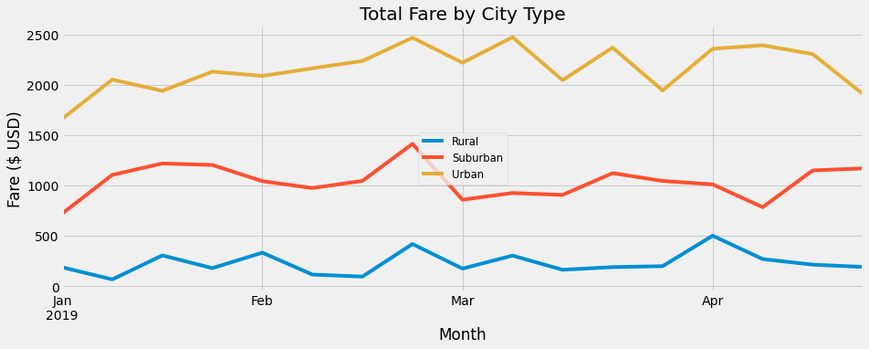

# PyBer_Analysis

## Pyber Analysis Overview

The report reflects specific city type data to show ride share differences based on location. Ranging from 
total rides, total drivers, total fares paid, average fare per ride, average ride per driver, and the total fare 
based on city type. This break down allows us to view the differences within the data, and use the information to 
address the disparities. 

## Pyber Analysis Results
#### Pyber Ride Data:
After review of the data in the image shown below we noticed the following for each city type: 

### Rural Results
  - In the Rural locations we see very little activity, as well as far fewer available drivers, however, the fare
cost is substantially higher compared to Urban and Suburban averages.

### Urban Results
  - The Urban locations are the only locations with more drivers than rides, compared to Rural and Suburban numbers. 
The total fares show 2x higher than Suburban locations, and almost 10x higher than Rural while simultaneously showing
the lowest cost per driver average at $23 - $38 lower. 

### Suburban Results
  - The Suburban locations land right in the middle on nearly all categories between Rural and Urban. In the way that
Rural locations have less drivers avaiable than rides, this is also the case for Suburban. 

## Pyber Analysis Summary

### Summary recommendations:
Based on our findings we can recommend some advancements that may help address the disparities based on location.
  - 1 - Try to obtain a larger group of local drivers within the Rural areas to aid supplying more rides, leading to
additional growth in total fares. With more accessability there will be an increase in use and profit. 
  - 2 - Review time frames of rides based on area to gain a better understanding of ride needs.  
  - 3 - Utilize driver incentives to expand coverage areas. This will help to increase use and profit in otherwise 
unaccessable locations. 
